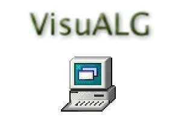

# Programming Logic and Algorithms (VisualG)

This repository stores my studies and practical exercises on Programming Logic. The main focus is developing logical reasoning through the implementation of algorithms in Portugol, using the VisualG software.

All content was developed during the **Algorithms and Programming Logic** course by Professor Nelio Alves.

---

## Studied Content

Currently, the repository contains exercises focused on:

* **Conditional Structures**: Use of `if-then-else` (se-entao-senao) for decision making.
* **Repetitive Structures (Loops)**:
    * **while (enquanto)**: For repetitions with specific stop conditions.
    * **for (para)**: For repetitions with a defined range/interval.
    * **do-while (repita-ate)**: For executions that occur at least once before checking the condition.

---

## Tools Used

<table align="center">
  <tr>
    <td align="center">
      <b>VisualG 3.0</b> 
      Interpretador de algoritmos utilizado para os testes e execuções das atividades propostas.
    </td>
  </tr>
  <tr>
    <td align="center">
      
    </td>
  </tr>
</table>

---
